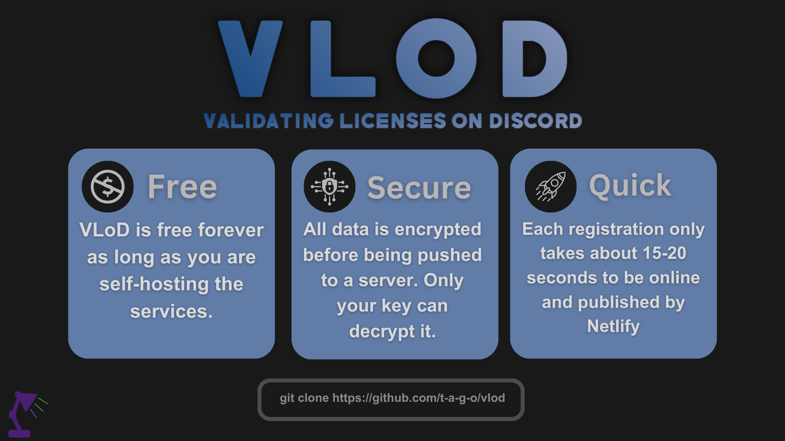

<div align="center">
    </a>
    <br />
    
   [tagoWorks](https://tago.works/) - [Discord](https://tago.works/discord)
   
   
   
   

   *there is definitely an easier way to make a licensing service but idc*
   
   Validating Licenses on Discord bot is a user license validation tool coded in javascript and python, and uses GitHub and Netlify as licensing servers. **Completely free forever. And Encrypted.** The VLoD bot allows
   users to validate their license that they purchased from your site, using a simple command. I created this because I was going to make licensed code later in the future and all licensing services costed money eventually.
   VLoD works by creating a new directory with the validated users email and in it it creates the check file with the license code, VLoD then copies this files over to your local git repo (encrypting the contents of the check file) and commits the
   changes. Your GitHub repository will be hosted on Netlify in order to have the files accessable from anywhere. Then in your software code just import the [VLoDVP](https://github.com/t-a-g-o/vlod/tree/vlodvp) package and then obfuscate your final code in order
   to hide the private key. I recommend [Hyperion](https://github.com/billythegoat356/Hyperion) as it is the most effective and hardest to decypt. VLoD is open source and I encourge you to make your own changes!

</div>


# Getting Started with VLoD & Netlify 🚀

## Setup webserver
1. Create a new private GitHub repo
   
2. Add a `index.html` file with any content (just so the site can deploy)
   
3. Head to https://netlify.com/ and Login or Create an account
   
4. Create your site via GitHub

5. Wait for site to deploy. You should have a link like "repositoryname.netlify.app"

## Prepare VLoD
1. Clone the repo
   ```sh
   git clone https://github.com/t-a-g-o/VLoD
   ```
   
2. CD into the directory
   ```sh
   cd VLoD
   ```
3. Download required modules by running the provied `GetReqs.bat` file
   
4. Open the `config.json` file with notepad or another text editor, and input all the values
   * token: Your discord bot token
   * prefix: The bots prefix for commands
   * owner: The owner's user ID (will be allowed to add licenses, remove cooldowns, and delete validated accounts)
   * onlySendIn: The channel ID's where the bot will be allowed to resond
   * logChannel: The channel ID where the bot will send license validation logs
   * GITUSERNAME: Your GitHub account username
   * GITSTORAGEREPO: The repository where the accounts and active licenses will be stored
   * GITPAT: Your GitHub personal access token (PAT), which is used to push the new accounts to the webserver repository
5. Open the `assets` directory and run the `StartService.bat` file in order to generate your `key.txt` file
   * It is very important to save this key, if you publish your projects and use this key and later on change it you will not be able to validate any licenses.

6. Input your custom licenses in the `license.txt` file
   * Remember to press ENTER after each license to be sure that the bot can write to the file without issues
   * When adding multiple licenses remember to press ENTER on the last string
   ```txt
   ABCD-EFGH-IJKL-MNOP
   ABCD-EFGH-IJKL-MNOP
   ABCD-EFGH-IJKL-MNOP

   ```

# Implement VLoD in your code 💻
For now VLoD can only be used for Python scripts. If you want to contribute and attempt to expand please feel free.
1. Download the [Validating Licenses on Discord Validating Package](https://github.com/t-a-g-o/vlod/tree/vlodvp)
   ```sh
   pip install VLoDVP
   ```
1. Import the package to your main code
   ```py
   import VLoDVP
   ```
2. Define your private key (`assets/key.txt`) and your new netlify webserver
   ```sh
   VLoDVP.setkey('12345678901234567890123456789012')
   VLoDVP.setlink('https://yourlink.netlify.app/')
   ```
3. Code a way for the user to input their email and license

   *emailvar and licensekeyvar can be anything*
   ```py
   emailvar = input("Enter email: ")
   licensekeyvar = input("Enter key: ")
   ```
4. Check if the account exists and the license is active on your webserver
   ```py
   if VLoDVP.validate(emailvar, licensekeyvar) == False:
      print("Invalid email or key")
   else:
      # Run your main code here
   ```
5. Obfuscate your code (optional)
 In order to hide your private key and licensing website link, I recommend you obfuscate your code with a python obfuscator. [Hyperion](https://github.com/billythegoat356/Hyperion) is very advanced and I personally use it for some of my code before.


If your having issues check out the example.py or join the [discord server](https://tago.works/discord)
# Discord Bot Usage 🤖
## Member usage
Users in your Discord server can validate their licenses by running the command "!license validate LICENSEKEY EMAIL" where the ! is your set prefix in the `config.js` file.
Any member of you discord server by default will be set to a 30 day cooldown in order to prevent any type of license fruad. To change this cooldown you can edit the "'const remainingTime = Math.ceil((30 * 24 * 60 * 60 * 1000 - (Date.now() - lastUsage)) / (1000 * 60 * 60 * 24));" line in `commands/license.js` to a set amount of milliseconds.

## Owner usage
As the owner, you can remove users cooldowns, add license keys, and deactive emails that are registered to a license key
*the following examples uses the prefix ! but you set your custom prefix in `config.js`*
* !license removecooldown USERID
* !license remove EMAILREGISTERED
* !license keyadd LICENSEKEY

**Note:**
To remove added license keys, or to add license keys in bulk you need to manually edit the `assets/license.txt` file, making sure that the last license key ends with pressing the ENTER key to go down a line.

# Roadmap 🛣️
- [x] Rename project (Nova -> VLoD)
- [x] Create VLoDVP package
- [ ] Expand on languages to license
- [ ] Auto save login in VLoDVP
- [ ] Add checks for invalid emails
- [ ] Add catches for when an invalid folder is created
- [ ] Convert bot commands to discord slash applications

# License & Information 📃
This project is published under the [MIT license](./LICENSE)

If you are interested in working together, or want to get in contact with me please email me at santiagobuisnessmail@gmail.com
