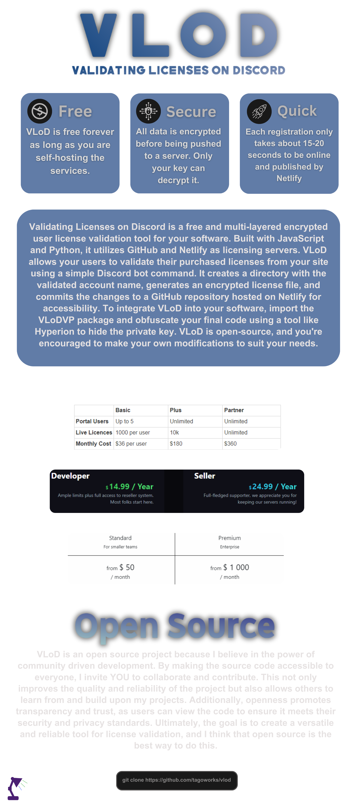

<div align="center">
    </a>
    <br />

   
   
   

   *there is definitely an easier way to make a licensing service but idc*

</div>

# Get Started with VLoD 🚀
### Watch the YouTube tutorial I made to get start with VLoD!
[](https://youtube.com/watch?v=ZGfnvUzBGG8)

# VLoD & Netlify Setup ⌨️

Here, there is a step by step instructions on how to setup and use VLoD, but I recommend watching the video above

## Setup webserver
1. Create a new private GitHub repo
   
2. Add a `index.html` file with any content (just so the site can deploy)
   
3. Head to https://app.netlify.com/ and Login or Create an account
   
4. Create your site via GitHub

5. Wait for site to deploy. You should have a link like "repositoryname.netlify.app"

## Prepare VLoD
1. Create a new folder & clone the repo
   ```sh
   git clone https://github.com/tagoworks/vlod
   ```
   
2. Open the new `vlod` folder
   
4. Download required modules by running the provided `GetReqs.bat` file
   
5. Open the `config.json` file with notepad or another text editor, and input all the values
   * token: Your discord bot token
   * ownerID: The owner's user ID (will be allowed to add licenses, remove cooldowns, and delete validated accounts)
   * guildID: The server ID which the bot will be in (for permission sets)
   * onlySendIn: The channel ID's where the bot will be allowed to respond
   * logChannel: The channel ID where the bot will send license validation logs
   * GITUSERNAME: Your GitHub account username
   * GITSTORAGEREPO: The repository where the accounts and active licenses will be stored
   * GITPAT: Your GitHub personal access token (PAT), which is used to push the new accounts to the webserver repository (give repo scopes)
   * netlifyURL: Your netlify link (https://repository.netlify.app/)
6. Open the `assets` directory and run the `StartService.bat` file in order to generate your `identifiers.txt` file
   * It is very important to save these keys, if you publish your projects and use this key and later on change it you will not be able to validate any licenses.

7. Input your custom licenses in the `license.txt` file
   * Remember to press ENTER after each license to be sure that the bot can write to the file without issues
   * When adding multiple licenses remember to press ENTER on the last string
      ```txt
      ABCD-EFGH-IJKL-MNOP
      ABCD-EFGH-IJKL-MNOP
      ABCD-EFGH-IJKL-MNOP
      ```

# Implement VLoD in your code 💻
For now VLoD can only be used for Python scripts. If you want to contribute and attempt to expand please feel free.
1. Download the [Validating Licenses on Discord Validating Package](https://github.com/tagoworks/vlodvp)
   ```sh
   pip install VLoDVP
   ```
2. Import the package to your main code
   ```py
   import VLoDVP
   ```
3. Define your private & public key (`assets/identifiers.txt`)
   ```sh
   VLoDVP.privatekey('hehSUUXf3m33ns9Hwenj')
   VLoDVP.publicserverkey('jweikAAAA-jemef-efj-_eneiebeufu_38h')
   ```
4. Code a way for the user to input their username and license

   *uservar and licensekeyvar can be anything*
   ```py
   uservar = input("Enter username: ")
   licensekeyvar = input("Enter key: ")
   ```
5. Check if the account exists and the license is active on your webserver
   ```py
   if VLoDVP.isValid(uservar, licensekeyvar) == False:
      print("Invalid username or key")
   else:
      # Run your main code here
   ```
6. Obfuscate your code (optional)
 In order to hide your private key and licensing website link, I recommend you obfuscate your code with a python obfuscator. [Hyperion](https://github.com/billythegoat356/Hyperion) is very advanced and I personally use it for some of my code before.


If your having issues check out the example.py or join the [discord server](https://tago.works/discord)
# Discord Bot Usage 🤖
## Member usage
Users in your Discord server can validate their licenses by running the command "/validate LICENSEKEY ACCOUNTNAME".
Any member of you discord server by default will be set to a 30 day cooldown in order to prevent any type of license fraud. To change this cooldown you can edit the "'const remainingTime = Math.ceil((30 * 24 * 60 * 60 * 1000 - (Date.now() - lastUsage)) / (1000 * 60 * 60 * 24));" line in `commands/validate.js` to a set amount of milliseconds.

## Owner usage
As the owner, you can remove users cooldowns, add license keys, and deactive accounts that are registered to a license key
* /removecooldown USERID
* /remove ACCOUNTNAME
* /keyadd LICENSEKEY

**Note:**
To remove added license keys, or to add license keys in bulk you need to manually edit the `assets/license.txt` file, making sure that the last license key ends with pressing the ENTER key to go down a line.

# Roadmap 🛣️
- [x] Rename project (Nova -> VLoD)
- [x] Create VLoDVP package
- [x] Convert bot commands to discord slash applications
- [x] Add checks for invalid account names
- [x] Add catches for when an invalid folder is created
- [x] Add public key functionality
- [ ] Use account ID to further secure logins
- [ ] Expand on languages to license
- [ ] Auto save login in VLoDVP
- [ ] Add expiring method

# License & Information 📃
This project is published under the [MIT license](./LICENSE)

If you are interested in working together, or want to get in contact with me please email me at santiagobuisnessmail@gmail.com
